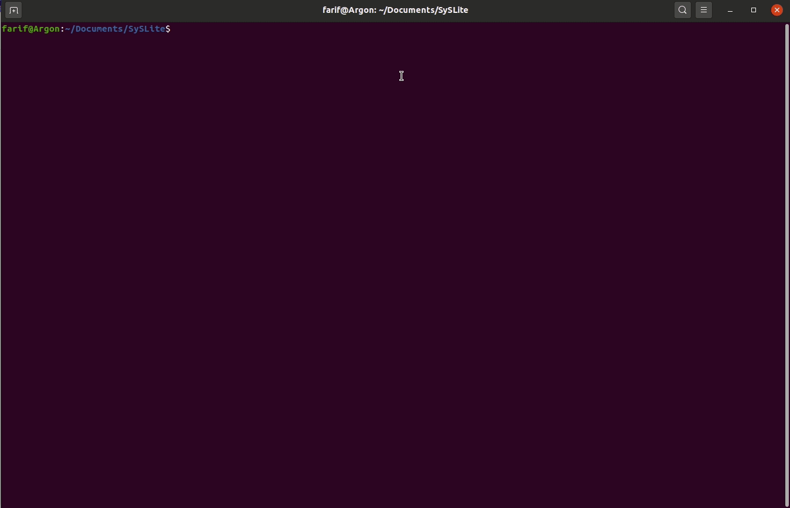

# SySLite 
<sub>Syntax-Guided Past-time LTL Synthesizer & Enumerator</sub>

SysLite makes use of decision and synthesis procedures (\ie `SAT`, `SMT`, and `SyGuS`) to learn `Pastime LTL formulas` from a finite set of example traces. These example traces describe the intended and unintended behavior in terms of positive and negative traces that can come from various application domains (i.e, security policy logs, protocols, and execution of a system or design model, among others). 
 
## Build & Test
Run commands on Terminal:

1. Build: `./tool-setup` (some machines may require running `apt-get install python3-venv` before `tool-setup`)
   * Continue? [Y]es/[N]o: Y 
   * Only required once to setup the tool  
2. Enable execution: `source env/bin/activate`
   * Required before executing the tool on a new terminal.  
3. Run: `./src/Driver.py --help`
4. Disable execution: `deactivate`
    
## Usage

An example trace file is added to learn back an emergency alert system (eas) formula. 
The trace [file](https://github.com/CLC-UIowa/SySLite/tree/master/eas-example) contains  
positive and negative traces that uses a format described below.

Please use the command to run eas trace example using `bit-vector SyGuS` encoding:

`./src/Driver.py -n 5 -r result.txt -a bv_sygus -dict -t eas-example/eas.trace`




## Supported Algorithms:
The tool currently supports a list of algorithms that can be invoked with `-a` option:

1. SyGus + BitVector + enumeration `bv_sygus`  
2. SyGuS + ADT + enumeration `adt_sygus` 
3. SMT + ADT + enumeration `fin_adt`
4. SAT - enumeration `sat`  
5. SAT + enumeration `sat_enum` 
6. SAT + Graph Topological - enumeration `guided_sat`  
7. SAT + Graph Topological + enumeration `guided_sat_enum`  

Example Encoding Files:
-----------------------
All the proposed encoding files are instantiated using 
[`eas.trace`](https://github.com/CLC-UIowa/SySLite/tree/master/eas-example) are:

1. [eas-adt-enc.sy](https://github.com/CLC-UIowa/SySLite/blob/master/eas-example/eas-adt-enc.sy) (\* ADT with SyGuS \*)
2. [eas-bv-enc.sy](https://github.com/CLC-UIowa/SySLite/blob/master/eas-example/eas-bv-enc.sy) (\* Bitvector with SyGuS \*)
3. [eas-fnf-enc.smt2](https://github.com/CLC-UIowa/SySLite/blob/master/eas-example/eas-fnf-enc.smt2) (\* ADT using Finite Model Finding \*) 

These encodings can be tested using off-the-shelf [CVC4SY](https://github.com/CLC-UIowa/SySLite/blob/master/resources/cvc4) solver using the commands:

`./cvc4 --lang=sygus2 --sygus-stream --sygus-sym-break-pbe FILENAME.sy`

`./cvc4 FILENAME.smt2`

### Input File Format:
An example trace file is provided in file [`eas.trace`](https://github.com/CLC-UIowa/SySLite/tree/master/eas-example).

The input traces files contains alphabets, positive and negative example traces, supported operators 
separated by `---`. 
```
p,q	//Atomic Propositions
---
1,1;0,0	(\* Positive Traces \*)
1,0;1,0
---
1,0;0,0	(\* Negative Traces \*)
---
!,Y,O,H	(\* Enable Unary Operators in Final Formula (Optional) \*)
---
S,&,|,=> (\* Enable Binary Operators in Final Formula (Optional) \*)
---
3	(\* Synthesized Formula Size (Optional) \*)
---
S(Y(q),q)	(\* Target Formula for Match (Optional) \*)
```

## Experiments:

The details about the experiments are described in the paper. 
The training and test data include results are contained in [Experiments](https://github.com/CLC-UIowa/SySLite/tree/master/experiments)

### Reference:

Report: ["SYSLITE: Syntax-Guided Synthesis of PLTL Formulas from Finite Traces"](https://github.com/CLC-UIowa/SySLite/blob/master/tech-report.pdf), FMCAD20 [accepted]


